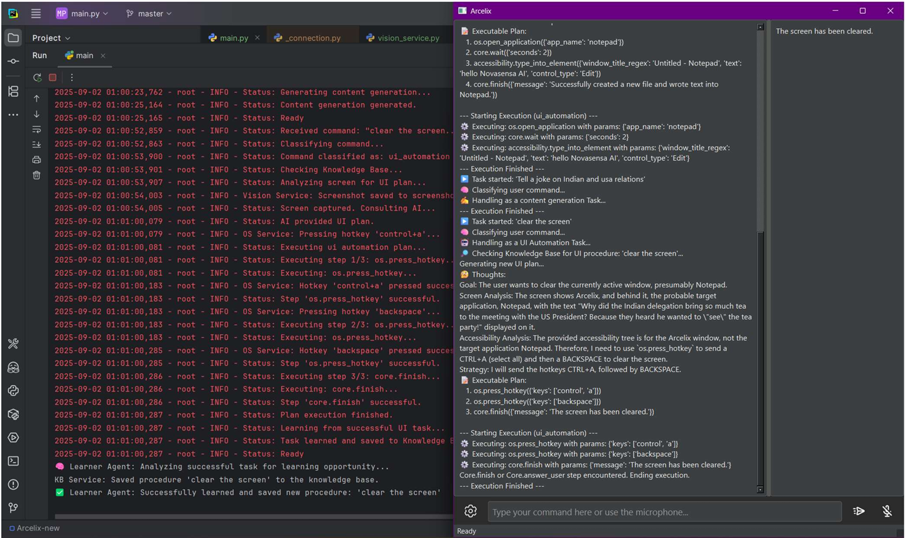

<div align="center">

# 🤖 Aura AI - Computer Use Agent

<p align="center">
  
  
  
  
  
</p>

**An intelligent AI assistant that understands voice commands and autonomously controls your computer through natural language interaction.**

[Features](#-features) • [Architecture](#-architecture) • [Installation](#-installation) • [Usage](#-usage) • [Documentation](#-documentation) • [Contributing](#-contributing)

</div>

---

## 📋 Table of Contents

- [Overview](#-overview)
- [Features](#-features)
- [Architecture](#-architecture)
- [Technology Stack](#-technology-stack)
- [Installation](#-installation)
- [Configuration](#-configuration)
- [Usage](#-usage)
- [Project Structure](#-project-structure)
- [Agents](#-agents)
- [Services](#-services)
- [Development](#-development)
- [Testing](#-testing)
- [Documentation](#-documentation)
- [Roadmap](#-roadmap)
- [Contributing](#-contributing)
- [License](#-license)
- [Acknowledgments](#-acknowledgments)

---

## 🌟 Overview

**Aura AI** is a sophisticated computer use agent that leverages cutting-edge AI technologies to provide seamless computer automation through voice and text commands. Built with a modular multi-agent architecture, Aura can understand complex user intentions, plan execution strategies, and interact with your operating system to accomplish tasks autonomously.

## 💡 Quick Demo



---

### Why Aura?

- 🎯 **Natural Interaction**: Communicate with your computer using natural language
- 🧠 **Intelligent Planning**: Multi-agent system that understands context and plans complex tasks
- 🔒 **Secure**: Built-in credential management with encryption
- 🎨 **Modern UI**: Beautiful PyQt6 interface with dark/light theme support
- 🔌 **Extensible**: Modular architecture for easy feature additions
- 🌐 **Web Automation**: Automated browser interactions for web-based tasks

---

## ✨ Features

### Core Capabilities

- **🎤 Voice Control**: Wake-word activation ("Hey CC") using Porcupine, powered by OpenAI Whisper for speech recognition
- **💬 Natural Language Understanding**: Powered by Google Gemini 1.5 Flash for intent recognition and context understanding
- **🤖 Multi-Agent System**: Specialized agents for perception, NLU, planning, and action execution
- **🖥️ OS Automation**: Complete system control via PyAutoGUI and OS-specific APIs
- **🌐 Web Automation**: Selenium-based browser automation for web tasks
- **🔐 Credential Management**: Secure storage with master password and encryption
- **♿ Accessibility**: Screen reader support and accessibility service integration
- **🎨 Customizable UI**: Dark and light themes with responsive design
- **📊 Real-time Status**: Live feedback and execution status display

### Advanced Features

- **Vision Capabilities**: Screen understanding and visual context awareness
- **Clipboard Integration**: Smart clipboard operations
- **Context Preservation**: Maintains execution context across tasks
- **Error Handling**: Robust error recovery and user feedback
- **Background Processing**: Non-blocking task execution
- **Extensible Architecture**: Easy to add new capabilities and services

---

## 🏗️ Architecture

Aura follows a **layered, multi-agent architecture** that separates concerns and enables scalability:

```
┌─────────────────────────────────────────────────────────┐
│                    User Interface (PyQt6)                │
│  ┌──────────┐  ┌──────────┐  ┌──────────┐  ┌─────────┐ │
│  │ Command  │  │  Status  │  │ Settings │  │ Themes  │ │
│  │   Input  │  │ Display  │  │  Dialog  │  │ Manager │ │
│  └──────────┘  └──────────┘  └──────────┘  └─────────┘ │
└─────────────────────────────────────────────────────────┘
                            ↕
┌─────────────────────────────────────────────────────────┐
│              Main Orchestrator (Coordinator)             │
│  - Command Processing  - Agent Coordination              │
│  - Execution Planning  - State Management                │
└─────────────────────────────────────────────────────────┘
                            ↕
┌─────────────────────────────────────────────────────────┐
│                    Agent Layer                           │
│  ┌──────────┐ ┌──────────┐ ┌──────────┐ ┌──────────┐  │
│  │   NLU    │ │ Planning │ │  Action  │ │Perception│  │
│  │  Agent   │ │  Agent   │ │  Agent   │ │  Agent   │  │
│  └──────────┘ └──────────┘ └──────────┘ └──────────┘  │
└─────────────────────────────────────────────────────────┘
                            ↕
┌─────────────────────────────────────────────────────────┐
│                   Service Layer                          │
│  ┌──────────┐ ┌──────────┐ ┌──────────┐ ┌──────────┐  │
│  │  Gemini  │ │  Voice   │ │    OS    │ │   Web    │  │
│  │ Service  │ │ Service  │ │Interaction│ │Automation│  │
│  └──────────┘ └──────────┘ └──────────┘ └──────────┘  │
│  ┌──────────┐ ┌──────────┐ ┌──────────┐               │
│  │   TTS    │ │ Whisper  │ │  Cred.   │               │
│  │ Service  │ │ Service  │ │ Manager  │               │
│  └──────────┘ └──────────┘ └──────────┘               │
└─────────────────────────────────────────────────────────┘
```

### Agent Workflow

1. **Perception Agent**: Captures user input (voice/text) and system state
2. **NLU Agent**: Understands user intent and extracts parameters
3. **Planning Agent**: Creates step-by-step execution plans
4. **Action Agent**: Executes planned actions on the system

---

## 🛠️ Technology Stack

### Core Technologies

| Component | Technology | Purpose |
|-----------|-----------|---------|
| **AI/LLM** | Google Gemini 1.5 Flash | Natural language understanding, planning, vision |
| **UI Framework** | PyQt6 | Modern cross-platform desktop interface |
| **Speech-to-Text** | OpenAI Whisper | Local speech recognition |
| **Text-to-Speech** | Tortoise TTS | High-quality voice synthesis |
| **Wake Word** | Porcupine | "Hey CC" detection |
| **OS Automation** | PyAutoGUI | Mouse/keyboard control |
| **Web Automation** | Selenium | Browser automation |
| **Security** | Cryptography | Credential encryption |

### Python Packages

```
PyQt6              # UI Framework
openai-whisper     # Speech recognition
tortoise-tts       # Text-to-speech
google-generativeai # Gemini API
pyautogui          # OS automation
pyperclip          # Clipboard operations
selenium           # Web automation
python-dotenv      # Environment configuration
requests           # HTTP client
cryptography       # Secure credential storage
```

---

## 📦 Installation

### Prerequisites

- **Python 3.10 or higher**
- **Operating System**: Windows (primary), macOS/Linux (experimental)
- **Microphone** (for voice features)
- **Internet connection** (for Gemini API)

### Step 1: Clone the Repository

```bash
git clone https://github.com/SatyamSingh-Git/CC_computer_use_agent.git
cd CC_computer_use_agent
```

### Step 2: Create Virtual Environment

```bash
# Windows
python -m venv venv
venv\Scripts\activate

# macOS/Linux
python3 -m venv venv
source venv/bin/activate
```

### Step 3: Install Dependencies

```bash
pip install -r requirements.txt
```

### Step 4: Download Wake Word Model

The Porcupine wake word model is included in `assets/porcupine_models/`. Ensure the file `Hey-cc_en_windows_v3_0_0.ppn` exists.

### Step 5: Configure API Keys

1. Copy the template configuration:
   ```bash
   copy config\api_keys_tempelate.json config\api_keys.json
   ```

2. Edit `config/api_keys.json` with your credentials:
   ```json
   {
     "gemini_api_key": "YOUR_GEMINI_API_KEY_HERE"
   }
   ```

3. Get a Gemini API key from [Google AI Studio](https://makersuite.google.com/app/apikey)

---

## ⚙️ Configuration

### User Settings

Edit `config/user_settings.json` to customize Aura:

```json
{
  "theme": "dark",
  "voice_enabled": true,
  "wake_word_enabled": true,
  "tts_enabled": true,
  "log_level": "INFO"
}
```

### Default Settings

See `config/default_settings.json` for all available configuration options.

### Logging

Logs are stored in the `logs/` directory. Configure logging level in `config/user_settings.json` or via the UI settings dialog.

---

## 🚀 Usage

### Starting Aura

```bash
# Make sure virtual environment is activated
python main.py
```

### Voice Commands

1. **Wake Word Activation**: Say "Hey CC" to activate voice listening
2. **Give Commands**: Speak your command naturally
3. **Examples**:
   - "Open Chrome and search for Python tutorials"
   - "Create a new folder called Projects on my desktop"
   - "Send an email to john@example.com"
   - "Take a screenshot and save it"

### Text Commands

1. Type your command in the input bar at the bottom of the window
2. Press Enter or click the Send button
3. Watch the status display for execution updates

### Stop Execution

- Click the **Stop** button in the UI
- The current execution will be interrupted safely

### Credential Management

On first run:
1. Aura will prompt you to create a master password
2. This password encrypts all stored credentials
3. Service credentials (e.g., email, web accounts) can be saved securely

---

## 📁 Project Structure

```
CC_computer_use_agent/
│
├── main.py                      # Application entry point
├── requirements.txt             # Python dependencies
├── setup.py                     # Package setup configuration
│
├── aura_core/                   # Core backend logic
│   ├── main_orchestrator.py    # Main coordination logic
│   ├── agents/                  # Specialized agent modules
│   │   ├── perception_agent.py # User input & system state
│   │   ├── nlu_agent.py        # Natural language understanding
│   │   ├── planning_agent.py   # Task planning
│   │   └── action_agent.py     # Action execution
│   ├── services/                # External service wrappers
│   │   ├── gemini_service.py   # Gemini API integration
│   │   ├── voice_service.py    # Voice input handling
│   │   ├── whisper_services.py # Speech-to-text
│   │   ├── tts_services.py     # Text-to-speech
│   │   ├── os_interaction_service.py # OS automation
│   │   ├── web_automation_services.py # Browser control
│   │   ├── credential_manager.py # Secure credential storage
│   │   └── accessibility_service.py # Accessibility features
│   └── utils/                   # Utility functions
│       ├── logger_config.py    # Logging setup
│       ├── helpers.py          # Helper functions
│       └── exceptions.py       # Custom exceptions
│
├── aura_ui/                     # User interface
│   ├── main_window.py          # Main application window
│   ├── widgets/                # UI components
│   │   ├── command_input_bar.py
│   │   ├── status_display.py
│   │   ├── settings_dialogue.py
│   │   ├── credential_prompt_dialog.py
│   │   ├── notification_widget.py
│   │   └── stop_button.py
│   ├── themes/                 # UI themes
│   │   ├── dark_theme.qss     # Dark theme stylesheet
│   │   ├── light_theme.py     # Light theme
│   │   └── theme_manager.py   # Theme management
│   └── utils_ui/               # UI utilities
│       └── ui_helpers.py
│
├── config/                      # Configuration files
│   ├── constants.py            # Application constants
│   ├── default_settings.json   # Default configuration
│   ├── user_settings.json      # User preferences
│   └── api_keys_tempelate.json # API key template
│
├── assets/                      # Static resources
│   ├── fonts/                  # Custom fonts
│   ├── icons/                  # Application icons
│   ├── sounds/                 # Sound effects
│   └── porcupine_models/       # Wake word models
│       └── Hey-cc_en_windows_v3_0_0.ppn
│
├── tests/                       # Test suite
│   ├── test_core/              # Core logic tests
│   ├── test_ui/                # UI tests
│   └── test_integration/       # Integration tests
│
├── docs/                        # Documentation
│   ├── README.md               # This file
│   ├── architecture.md         # Architecture details
│   ├── api_referance.md        # API documentation
│   ├── Dev_plan.md             # Development roadmap
│   └── structure.md            # Project structure
│
└── logs/                        # Application logs
```

---

## 🤖 Agents

### Perception Agent

**Responsibility**: Capture and preprocess user input and system state

- Receives voice/text commands
- Captures screen context when needed
- Provides system state information
- Integrates with voice service and accessibility APIs

### NLU Agent (Natural Language Understanding)

**Responsibility**: Understand user intent and extract parameters

- Powered by Google Gemini 1.5 Flash
- Identifies command intent (e.g., "open_application", "web_search")
- Extracts entities and parameters
- Handles ambiguity and context

### Planning Agent

**Responsibility**: Create execution plans from understood intent

- Generates step-by-step action plans
- Considers system constraints
- Handles complex multi-step tasks
- Optimizes execution order

### Action Agent

**Responsibility**: Execute planned actions on the system

- OS-level operations (mouse, keyboard, applications)
- Web automation (browser control)
- File system operations
- Application interactions

---

## 🔧 Services

### Gemini Service

Wrapper for Google Gemini 1.5 Flash API

- Text generation and understanding
- Vision capabilities for screen analysis
- Streaming responses for real-time feedback

### Voice Service

Wake word detection and voice input management

- Porcupine wake word engine ("Hey CC")
- Audio capture and preprocessing
- Integration with Whisper service

### Whisper Service

OpenAI Whisper-based speech recognition

- Local, privacy-focused speech-to-text
- Multiple model sizes supported
- Fast inference on CPU/GPU

### TTS Service

Tortoise TTS for natural voice synthesis

- High-quality voice generation
- Customizable voice parameters
- Async generation for responsiveness

### OS Interaction Service

System-level automation

- Mouse and keyboard control (PyAutoGUI)
- Window management
- Application launching
- Clipboard operations

### Web Automation Service

Browser automation with Selenium

- Navigate websites
- Fill forms
- Click elements
- Extract data

### Credential Manager

Secure credential storage

- Master password protection
- Encrypted storage (Fernet encryption)
- Service-specific credentials
- Secure credential retrieval for automation

### Accessibility Service

System accessibility features

- Screen reader integration
- UI element detection
- Accessibility tree navigation

---

## 💻 Development

### Setting Up Development Environment

1. Install development dependencies:
   ```bash
   pip install -r requirements.txt
   pip install pytest pytest-qt black flake8
   ```

2. Configure your IDE (VS Code recommended):
   - Install Python extension
   - Configure linting (flake8)
   - Set up formatting (black)

### Code Style

- Follow **PEP 8** guidelines
- Use **Black** for code formatting
- Maximum line length: 120 characters
- Use type hints where applicable

### Running in Development Mode

```bash
# Enable debug logging
python main.py --debug

# Or set in user_settings.json
{
  "log_level": "DEBUG"
}
```

### Adding New Features

1. Create a new branch: `git checkout -b feature/your-feature-name`
2. Implement your feature following the modular architecture
3. Add tests for new functionality
4. Update documentation
5. Submit a pull request

---

## 🧪 Testing

### Running Tests

```bash
# Run all tests
pytest

# Run specific test module
pytest tests/test_core/test_nlu_agent.py

# Run with coverage
pytest --cov=aura_core --cov=aura_ui
```

### Test Structure

- `tests/test_core/`: Unit tests for agents and services
- `tests/test_ui/`: UI component tests
- `tests/test_integration/`: End-to-end integration tests

### Writing Tests

Use pytest fixtures and follow the existing test patterns:

```python
import pytest
from aura_core.agents.nlu_agent import NLUAgent

def test_nlu_intent_recognition():
    agent = NLUAgent(gemini_service)
    result = agent.process("open Chrome")
    assert result['intent'] == 'open_application'
    assert 'chrome' in result['parameters']['app_name'].lower()
```

---

## 📚 Documentation

### Additional Resources

- **[Architecture Documentation](docs/architecture.md)**: Detailed system architecture
- **[API Reference](docs/api_referance.md)**: API documentation
- **[Development Plan](docs/Dev_plan.md)**: Roadmap and development phases
- **[Project Structure](docs/structure.md)**: Detailed structure explanation

### API Documentation

For detailed API documentation, see [api_referance.md](docs/api_referance.md).

### Contributing Guide

See [CONTRIBUTING.md](CONTRIBUTING.md) for contribution guidelines.

---

## 🗺️ Roadmap

### Current Phase: Beta Development

- [x] Core multi-agent architecture
- [x] Voice input with wake word
- [x] Basic OS automation
- [x] Web automation capabilities
- [x] Secure credential management
- [x] PyQt6 modern UI
- [ ] Enhanced error recovery
- [ ] Plugin system
- [ ] Cloud sync for settings

### Future Enhancements

#### Phase 1: Stability & Polish
- Comprehensive test coverage (80%+)
- Performance optimizations
- Better error messages
- Enhanced logging and debugging

#### Phase 2: Advanced Features
- Multi-language support
- Custom voice training
- Workflow automation builder
- Integration with popular apps (Slack, Email, Calendar)

#### Phase 3: Intelligence
- Learning from user patterns
- Proactive suggestions
- Context-aware task prediction
- Improved vision capabilities

#### Phase 4: Ecosystem
- Plugin marketplace
- Community-contributed agents
- Cloud service integration
- Mobile companion app

---

## 🤝 Contributing

We welcome contributions from the community! Here's how you can help:

### Ways to Contribute

- 🐛 **Report bugs**: Open an issue with detailed reproduction steps
- 💡 **Suggest features**: Share your ideas in the discussions
- 📝 **Improve documentation**: Help make docs clearer and more comprehensive
- 🔧 **Submit pull requests**: Fix bugs or implement new features
- 🧪 **Write tests**: Improve test coverage
- 🎨 **Design**: Contribute UI/UX improvements

### Contribution Process

1. Fork the repository
2. Create a feature branch (`git checkout -b feature/AmazingFeature`)
3. Commit your changes (`git commit -m 'Add some AmazingFeature'`)
4. Push to the branch (`git push origin feature/AmazingFeature`)
5. Open a Pull Request

### Code of Conduct

Please be respectful and constructive in all interactions. We're building this together!

---

## 📄 License

This project is licensed under the **MIT License** - see the [LICENSE](LICENSE) file for details.

```
MIT License

Copyright (c) 2025 Satyam Singh

Permission is hereby granted, free of charge, to any person obtaining a copy
of this software and associated documentation files (the "Software"), to deal
in the Software without restriction, including without limitation the rights
to use, copy, modify, merge, publish, distribute, sublicense, and/or sell
copies of the Software, and to permit persons to whom the Software is
furnished to do so, subject to the following conditions:

The above copyright notice and this permission notice shall be included in all
copies or substantial portions of the Software.

THE SOFTWARE IS PROVIDED "AS IS", WITHOUT WARRANTY OF ANY KIND, EXPRESS OR
IMPLIED, INCLUDING BUT NOT LIMITED TO THE WARRANTIES OF MERCHANTABILITY,
FITNESS FOR A PARTICULAR PURPOSE AND NONINFRINGEMENT. IN NO EVENT SHALL THE
AUTHORS OR COPYRIGHT HOLDERS BE LIABLE FOR ANY CLAIM, DAMAGES OR OTHER
LIABILITY, WHETHER IN AN ACTION OF CONTRACT, TORT OR OTHERWISE, ARISING FROM,
OUT OF OR IN CONNECTION WITH THE SOFTWARE OR THE USE OR OTHER DEALINGS IN THE
SOFTWARE.
```

---

## 🙏 Acknowledgments

### Technologies & Libraries

- **Google Gemini**: For powerful AI capabilities
- **OpenAI Whisper**: For accurate speech recognition
- **PyQt6**: For the robust UI framework
- **Porcupine**: For wake word detection
- **Tortoise TTS**: For natural voice synthesis

### Inspiration

This project draws inspiration from:
- Anthropic's Computer Use Agent
- Open source AI assistants
- The vision of truly conversational computing

### Community

Thanks to all contributors and the open-source community for making this possible!

---

## 📞 Contact & Support

- **Author**: Satyam Singh
- **GitHub**: [@SatyamSingh-Git](https://github.com/SatyamSingh-Git)
- **Repository**: [CC_computer_use_agent](https://github.com/SatyamSingh-Git/CC_computer_use_agent)
- **Issues**: [GitHub Issues](https://github.com/SatyamSingh-Git/CC_computer_use_agent/issues)

### Getting Help

- 📖 Check the [documentation](docs/)
- 🐛 Report bugs via [GitHub Issues](https://github.com/SatyamSingh-Git/CC_computer_use_agent/issues)
- 💬 Join discussions in the [Discussions](https://github.com/SatyamSingh-Git/CC_computer_use_agent/discussions) section
- 📧 For security issues, please email directly (see GitHub profile)

---

<div align="center">

### ⭐ Star this repository if you find it useful!

**Made with ❤️ by Satyam Singh**

[⬆ Back to Top](#-aura-ai---computer-use-agent)

</div>
